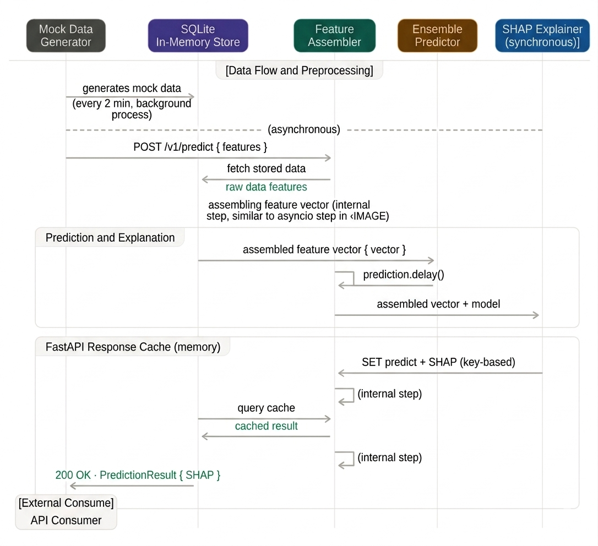

# TensorX — Simulation Mode Guide

**Development & Testing Edition — Quick Reference for `feature/simulation-mode` Branch**

This guide covers the **simulation mode** architecture, which is optimized for rapid prototyping, local development, and real-time validation without production infrastructure overhead.

---

## Quick Start

### Prerequisites
- **Python 3.12+**
- **pip** (or virtual environment manager)
- **SQLite 3** (included by default)

### Setup in 3 Steps

```bash
python venv -m <env-name>
# 1. Activate the virtual environment
source <env-name>/bin/activate

# 2. Install dependencies
pip install -r requirements.txt

# 3. Start the development server
cd src/api && python main.py
```

The API will be available at `http://localhost:8000` with interactive docs at `/docs`.

---

## Key Differences: Simulation vs. Production

| Aspect | Simulation Mode | Production Mode (`main`) |
|--------|-----------------|--------------------------|
| **Data Refresh** | Every **2 minutes** | Every **45 days** |
| **Job Scheduler** | `APScheduler` (local) | `Celery + Redis` (distributed) |
| **Storage** | In-memory SQLite | PostgreSQL + Redis |
| **ML Inference** | Synchronous (local) | Async (Celery workers) |
| **SHAP Caching** | In-memory (per-session) | Redis (24-hour TTL) |
| **Use Case** | Development & testing | Production lending |
| **Deployment** | Single process | Docker Compose (multi-container) |

---

## System Architecture

```

### Core Components

1. **Mock Data Generator** (`src/data/mock_generator.py`)
   - Generates 50 synthetic students every 2 minutes
   - Realistic feature distributions (CGPA, GRE, internships, etc.)
   - Automatically invalidates cache on new data

2. **Feature Assembler** (`src/ml/feature_assembler.py`)
   - Constructs 27-feature vector from raw student data
   - Matches production feature set exactly
   - Handles missing values & feature normalization

3. **Ensemble Predictor** (`src/ml/ensemble.py`)
   - XGBoost (50%) + Random Forest (30%) + Logistic Regression (20%)
   - Outputs 3-horizon placement probabilities (3mo, 6mo, 12mo)
   - Salary quantile regression (15th, 50th, 85th percentile)

4. **SHAP Explainer** (`src/ml/explainer.py`)
   - TreeExplainer for model interpretability
   - Maps feature indices to plain-English labels
   - Every inference includes SHAP driver breakdown

5. **APScheduler** (`src/jobs/scheduler.py`)
   - Triggers data refresh every 2 minutes
   - Invalidates in-memory caches
   - Logs refresh metrics (latency, feature distribution)

6. **SQLite Store** (`src/stores/sqlite_store.py`)
   - In-memory transactional database
   - Stores student profiles, predictions, audit logs
   - Fast R/W for rapid iteration

---

## API Endpoints

### Student Ingestion
```bash
curl -X POST http://localhost:8000/v1/students/ingest \
  -H "Content-Type: application/json" \
  -d '{
    "student_id": "STU-2024-001",
    "cgpa": 3.72,
    "gre_score": 325,
    "internship_count": 2,
    "is_international": true,
    "industry_preference": "Finance",
    "consent_contact": true,
    "consent_profile_analysis": true
  }'
```

### Get Placement Score & Explainability
```bash
curl -X POST http://localhost:8000/v1/predictions/score \
  -H "Content-Type: application/json" \
  -d '{"student_id": "STU-2024-001"}'
```

**Response (synchronous in simulation):**
```json
{
  "student_id": "STU-2024-001",
  "placement_probability": {
    "3_months": {"probability": 0.72, "risk_tier": "LOW"},
    "6_months": {"probability": 0.85, "risk_tier": "LOW"},
    "12_months": {"probability": 0.93, "risk_tier": "LOW"}
  },
  "salary_estimate": {
    "lower_bound": 35000,
    "median": 48000,
    "upper_bound": 62000,
    "currency": "INR"
  },
  "shap_drivers": [
    {
      "driver_name": "Strong Academic Foundation (CGPA)",
      "contribution": 0.18,
      "direction": "positive"
    }
  ],
  "model_version": "v1.0-simulation"
}
```

### List HIGH-Risk Exceptions
```bash
curl http://localhost:8000/v1/alerts/exceptions?risk_tier=HIGH
```

### Health Check
```bash
curl http://localhost:8000/v1/health
```

---

## Testing

```bash
# Run all tests with coverage
pytest tests/ -v --cov=src

# Run specific test suites
pytest tests/test_data_models.py -v      # Schema validation
pytest tests/test_ml_pipeline.py -v      # Model inference
pytest tests/test_api.py -v              # HTTP endpoints
pytest tests/test_refresh_logic.py -v    # Scheduler & caching

# Generate coverage report
pytest tests/ --cov=src --cov-report=html
open htmlcov/index.html
```

### Test Coverage

| Module | Focus |
|--------|-------|
| `test_data_models.py` | Pydantic V2 validation, CGPA bounds, type enforcement |
| `test_ml_pipeline.py` | Feature assembly, ensemble predictions, SHAP extraction, salary quantiles |
| `test_api.py` | HTTP contract validation, request/response schemas |
| `test_refresh_logic.py` | APScheduler intervals, cache invalidation, audit trail |

---

## Configuration

Settings in `config/settings.py`:

```python
# Data refresh interval (simulation mode only)
DATA_REFRESH_INTERVAL_SECONDS = 120  # 2 minutes

# Mock data generation
MOCK_STUDENT_COUNT = 50
CGPA_MEAN = 3.5
GRE_SCORE_MEAN = 320

# Risk tier thresholds (from config/thresholds.json)
RISK_THRESHOLDS = {
    "3": {"HIGH": 0.25, "LOW": 0.50},
    "6": {"HIGH": 0.35, "LOW": 0.65},
    "12": {"HIGH": 0.40, "LOW": 0.70}
}

# Feature label map (for SHAP output)
FEATURE_LABEL_MAP_PATH = "src/data/feature_label_map.json"

# Database
DATABASE_URL = "sqlite:///:memory:"
```

### Override Settings via Environment
```bash
export DATA_REFRESH_INTERVAL_SECONDS=30
export MOCK_STUDENT_COUNT=20
python src/api/main.py
```

---

## Understanding the Output

### Risk Tiers

Derived from placement probability thresholds (configurable):

```json
{
  "3": {
    "HIGH": 0.25,   // P(placed | 3mo) ≤ 25% → HIGH risk
    "LOW": 0.50     // P(placed | 3mo) ≥ 50% → LOW risk
  },
  "6": {
    "HIGH": 0.35,
    "LOW": 0.65
  },
  "12": {
    "HIGH": 0.40,
    "LOW": 0.70
  }
}
```

**MEDIUM risk** = Between HIGH and LOW thresholds.

### Salary Bands

Three quantile estimates provide expected salary range:

```
15th percentile    50th percentile (median)    85th percentile
    ₹35,000      →      ₹48,000           →       ₹62,000
```

Band coverage validation: 65–75% of holdout predictions should fall within bounds.

### SHAP Drivers

Ranked by absolute contribution magnitude (top 5 shown):

```json
{
  "driver_name": "Strong Academic Foundation (CGPA)",
  "contribution": 0.18,
  "direction": "positive"  // "positive" or "negative"
}
```

---

## Automated Data Refresh (Every 2 Minutes)

The scheduler automatically:

1. **Clears** in-memory SQLite store
2. **Generates** new synthetic cohort (50 students)
3. **Assembles** 27-feature vectors
4. **Predicts** placement probabilities (3 horizons) + salary quantiles
5. **Explains** predictions via SHAP
6. **Classifies** exception cases (HIGH-risk students)
7. **Logs** refresh metrics

Monitor via logs:
```bash
tail -f src/logs/refresh.log
```

Watch for output like:
```
[2024-04-21 10:30:00] Refresh job triggered
[2024-04-21 10:30:00] Generated 50 mock students
[2024-04-21 10:30:01] Assembled features (27-dim)
[2024-04-21 10:30:02] Ensemble predictions: 3mo/6mo/12mo probabilities
[2024-04-21 10:30:03] SHAP explanations computed (250ms avg)
[2024-04-21 10:30:03] Risk classification: 1 HIGH, 8 MEDIUM, 41 LOW
[2024-04-21 10:30:03] Refresh complete (3.2s)
```

---

## Troubleshooting

### API won't start
```bash
# Ensure virtual environment is activated
which python  # Should show tensorx/bin/python

# Force reinstall dependencies
pip install -r requirements.txt --force-reinstall

# Check port 8000 is free
lsof -i :8000  # Kill if needed: lsof -ti:8000 | xargs kill -9
```

### Data refresh not triggering
```bash
# Enable DEBUG logging
export LOG_LEVEL=DEBUG
python src/api/main.py

# Watch for "Refresh job triggered" in console output
```

### SHAP computation is slow
- Expected on first run (CPU-intensive TreeExplainer)
- In-memory cache not persistent (unlike production Redis)
- Use smaller cohort: `export MOCK_STUDENT_COUNT=10`

### Model predictions unrealistic
- Mock models don't use real training data
- Feature distributions are synthetic
- Compare against thresholds in `config/thresholds.json`
- Run validation: `pytest tests/test_ml_pipeline.py::test_salary_band_coverage`

---

## 📂 Branch-Specific Files

These files are unique to simulation mode:

```
src/data/mock_generator.py          # Synthetic data factory
src/jobs/scheduler.py               # APScheduler (not in production)
src/stores/sqlite_store.py          # In-memory SQLite
config/settings.py                  # Simulation-specific config
```

---